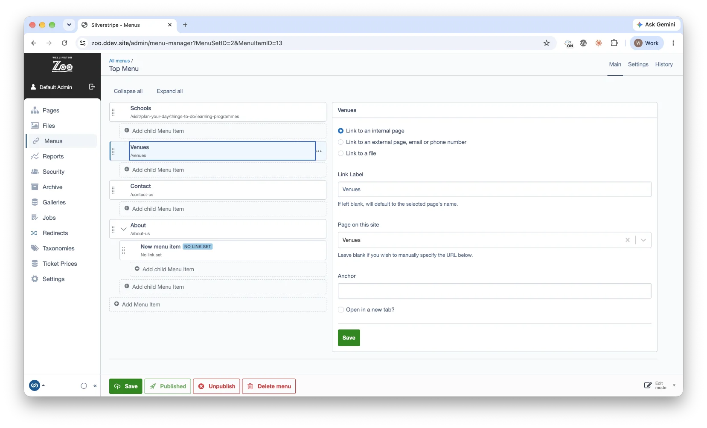

# Silverstripe Menu Manager

The menu management module is for creating custom menu structures when the site
tree hierarchy just won't do.



## Installation

```sh
composer require heyday/silverstripe-menumanager
```

Run `sake db:build` afterwards. 

## Usage


### Drafts and publishing

Menus are versioned. Adding, editing, moving and reordering changes the draft
only, and the tree marks anything not yet live: draft rows are italic and show
an orange status dot, and the menu picker marks a menu that has
never been published.

**Publish menu** sends the menu and all of its links live in one go.
**Unpublish** takes it off the live site while keeping the draft. Deleting is
immediate rather than staged: it archives the record, taking it off live too.

### A note on the preview and the record id

The CMS preview watches for an input named `ID` in the content panel. When the page in the preview
does not match it, the CMS navigates to that page's edit form. A menu is never the page being
previewed, so the section would throw the member into the Pages section the moment the preview
loaded. The record id therefore travels as `MenuSetID`, and `MenuAdmin` overrides `save()` and
`delete()` to read it from there.

### Previewing

Menus are previewable, so the site opens beside the tree in the CMS preview
panel with draft and published toggles, the same as editing a page. A menu is
not a page, so the preview opens the site's home page, which is where a menu is
actually seen. Point it somewhere else per site:

```yaml
Heyday\MenuManager\MenuSet:
    preview_url: 'https://example.com/about-us'
```

Switching the preview to Draft renders the site with unpublished menu changes,
which is the point of publishing being a separate step.

### History and rollback

Each menu and each link has a **History** tab showing who changed it and when,
with the option to roll back to an earlier version. History needs the
`silverstripe/versioned-admin` module, which is installed as a dependency.

Anyone with `MANAGE_MENU_SETS` or `MANAGE_MENU_ITEMS` can see draft menus. That
is configured through `non_live_permissions`.

### Creating a MenuSet

Open the `Menus` section and choose **Add menu**, then fill in the Settings tab.
Publish the menu once you are happy with it.

A menu has two labels:

* **Title** is what editors see, in the menu picker and everywhere else in the
  CMS. It is free text and safe to change at any time.
* **Name** is the reference templates use, as in `$MenuSet('MainMenu')`. Spaces
  are stripped from it on save.

A new menu starts without a name, so the first thing to do on the Settings tab
is give it one. Menus listed under `default_sets` have a readonly name, because
templates and configuration refer to them by it. Other menus keep their name
editable, with a warning that changing it can break those references.

A menu listed under `default_sets` cannot be deleted either, because the site
depends on it. Its title can still be changed.

As it is common to reference MenuSets by name in templates, you can configure
sets to be created automatically during the /dev/build task. These sets cannot
be deleted through the CMS.

```yaml
Heyday\MenuManager\MenuSet:
    default_sets:
        - Main
        - Footer
```

### Creating MenuItems

Select a menu set in the tree and use the **+** on its row to add a link. Use
the **+** on a link to nest another link inside it.

MenuItems have 4 important fields:

1. Page
2. MenuTitle
3. Link
4. IsNewWindow

#### Page

A page to associate your MenuItem with.

#### MenuTitle

This field can be left blank if you link the menu item with a page. If not fill
with the title you want to display in the template.

#### Link

This field can be left blank unless you want to link to an external website.
When left blank using $Link in templates will automatically pull the link from
the MenuItems associated Page. If you enter a link in this field and then pick a
Page as well the link will be overwritten by the Page you chose.

#### IsNewWindow

Can be used as a check to see if 'target="\_blank"' should be added to links.

### Limiting how deep a menu goes

Menus can be nested three levels deep. A design often has less room than that,
such as a footer that only shows a heading and the links under it, so a menu can
set its own limit with `max_menu_depth`, keyed by the menu's name:

```yml
Heyday\MenuManager\MenuSet:
    max_menu_depth:
        FooterMenu: 2
        FooterBottomMenu: 1
```

The depth counts top level links as 1, so:

* `1` allows top level links only.
* `2` allows links nested under top level links, but the **+** is not offered on
  a second level link, and nothing can be dragged or moved there.
* `4` or more raises the limit above the default for that menu alone.

A move that would push a link, or anything nested under it, past the limit is
refused. The limit is also enforced on the server, not just hidden in the tree.

Only whole numbers of 1 or more are supported. Anything else, including `0`,
throws an `InvalidArgumentException` on `dev/build` and when the menu is opened.
Menus left out of `max_menu_depth` keep the default, which applies to every menu
and is set on the tree source:

```yml
Heyday\MenuManager\TreeField\MenuItemTreeSource:
    max_depth: 3
```

Setting a limit does not change links that already sit deeper than it. They
still show and render, but nothing more can be added below the limit, and they
can only be moved somewhere that fits.

### Disable creating Menu Sets in the CMS

Sometimes the defined `default_sets` are all the menu's a project needs. You can
disable the ability to create new Menu Sets in the CMS:

```yml
Heyday\MenuManager\MenuAdmin:
    enable_cms_create: false
```

_Note: Non-default Menu Sets can still be deleted, to help tidy unwanted CMS
content._

### Usage in template

`$MenuItems` returns the top level of the menu. Nested links are excluded, so an
existing flat menu renders exactly as it did before. Use `$AllMenuItems` when
you want every link regardless of nesting.

```html
<% loop $MenuSet('YourMenuName').MenuItems %>
<a href="{$URL}" class="{$LinkingMode}">{$MenuTitle}</a>
<% end_loop %>
```

For a nested menu, descend into `$Children` on each link:

```html
<% loop $MenuSet('YourMenuName').MenuItems %>
<a href="{$URL}" class="{$LinkingMode}">{$MenuTitle}</a>
<% if $Children %>
<ul>
    <% loop $Children %>
    <li><a href="{$URL}" class="{$LinkingMode}">{$MenuTitle}</a></li>
    <% end_loop %>
</ul>
<% end_if %>
<% end_loop %>
```

To loop through _all_ MenuSets and their items:

```html
<% loop $MenuSets %> <% loop $MenuItems %>
<a href="{$URL}" class="{$LinkingMode}">{$MenuTitle}   </a>
<% end_loop %> <% end_loop %>
```

Optionally you can also limit the number of MenuSets and MenuItems that are
looped through.

The example below will fetch the top 4 MenuSets (as seen in Menu Management),
and the top 5 MenuItems for each:

```html
<% loop $MenuSets.Limit(4) %> <% loop $MenuItems.Limit(5) %>
<a href="{$URL}" class="{$LinkingMode}">{$MenuTitle}</a>
<% end_loop %> <% end_loop %>
```

#### Enabling partial caching

[Partial caching](https://docs.silverstripe.org/en/4/developer_guides/performance/partial_caching/)
can be enabled with your menu to speed up rendering of your templates.

```html
<% with $MenuSet('YourMenuName') %>
<% cached 'YourMenuNameCacheKey', $LastEdited, $MenuItems.max('LastEdited'), $MenuItems.count %>
<% if $MenuItems %>
<nav>
    <% loop $MenuItems %>
    <a href="{$URL}" class="{$LinkingMode}"> $MenuTitle.XML </a>
    <% end_loop %>
</nav>
<% end_if %>
<% end_cached %>
<% end_with %>
```

### Sorting menu sets

Menus are ordered by the `Sort` field on `MenuSet`, which the selector follows.
The old `allow_sorting` setting is gone.

## Subsite Support

If you're using SilverStripe Subsites, you can make MenuManager subsite aware
via applying an extension to the MenuSet.

_app/\_config/menus.yml_

```yaml
Heyday\MenuManager\MenuSet:
    create_menu_sets_per_subsite: true
    extensions:
        - Heyday\MenuManager\Extensions\MenuSubsiteExtension
Heyday\MenuManager\MenuItem:
    extensions:
        - Heyday\MenuManager\Extensions\MenuSubsiteExtension
```

## License

Menu Manager is licensed under an [MIT license](http://heyday.mit-license.org/)
